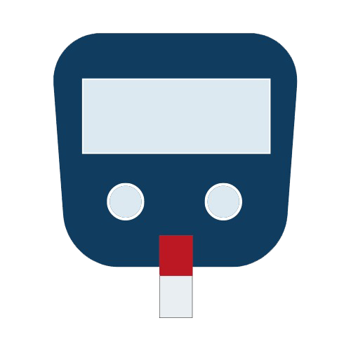

# Glucos-App - Capstone Project Bangkit 2022

<br />
<p align="center">
  <a href="https://github.com/herdiyusli/Glucos-App">
    
  </a>

  <h3 align="center">Glucos App</h3>
  <p align="center"><b>Applications for early detection of diabetes
    </b></p>
</p>

</br>
<h3>Backgrounder</h3>
The COVID-19 pandemic has made every activity shift from offline to online. Work from home is one of the factors that make a person less physically active which increases a person's risk of diabetes. Diabetes is a dangerous disease with a very high mortality rate. It is caused by increased levels of glucose in the blood which overtime will cause a number of complications, including kidney failure, blindness and heart attack.  A Journal of Cell Metabolism found a very high proportion (49.7%) of patients with COVID-19 experienced hyperglycemia. hyperglycemia is a condition in which blood glucose levels exceed its normal limit. If this happens continuously, it will lead to diabetes. Based on this background, we are interested in creating a diabetes detection application so that people can be more aware of diabetes during the pandemic. This application can be useful as a prevention and early detection tool to find out the possibility of someone having diabetes.

## Application Overview
<p float="left">
  
  
  
</p></br>


## Glucos Team C22-PC403
Our Repository click role of member
#### [Machine Learning](https://github.com/suryah-11/GlucosApp-ML):
* M2004F0190 - Paskalis Sinurat
* M2281G2418 - Surya Herdiansyah
* M2012G1210 - Mohammad Aldrin Arifin

#### [Mobile Development](https://github.com/herdiyusli/Glucos-App):
* A2009G0970 - Herdi Yusli

#### [Cloud Computing](https://github.com/WAHDINAAZIZAH/CC-GlucosApp):
* C2427F3003 - Wahdina Azizah</br>


## Installation

1. Clone the repo
   ```sh
   git clone https://github.com/herdiyusli/Glucos-App.git
   ```
2. Open folder GlucosApp to Android Studio
3. Run the project with your emulator or android phone</br>


## Tools, Library & Frameworks
* [Tensorflow](https://www.tensorflow.org/)
* [Laravel](https://laravel.com/)
* [Google Cloud Platform](https://cloud.google.com/)
* [Android Studio](https://developer.android.com/studio)
* [Kotlin](https://kotlinlang.org/)
* [Retrofit](https://square.github.io/retrofit/)</br>


## Links
* [APK](https://drive.google.com/file/d/1GkIS-7ro2QuJseyP7XAren_skHKBxtpu/view?usp=sharing)
* [Wireframe](https://www.figma.com/file/MRTE9MHb7sstnkMwLFXR6P/GlucoseApp?node-id=0%3A1)  
* [Mockup](https://www.figma.com/file/MRTE9MHb7sstnkMwLFXR6P/GlucoseApp?node-id=417%3A2)
* [Figma Prototype](https://www.figma.com/proto/MRTE9MHb7sstnkMwLFXR6P/GlucoseApp?node-id=456%3A2&scaling=min-zoom&page-id=421%3A420&starting-point-node-id=421%3A666)</br>


## References
* [Early Diabetes Classification Dataset](https://www.kaggle.com/datasets/andrewmvd/early-diabetes-classification)
* [Journal Reference - Diabetic during pandemic](https://jamanetwork.com/journals/jamainternalmedicine/fullarticle/2781811)

